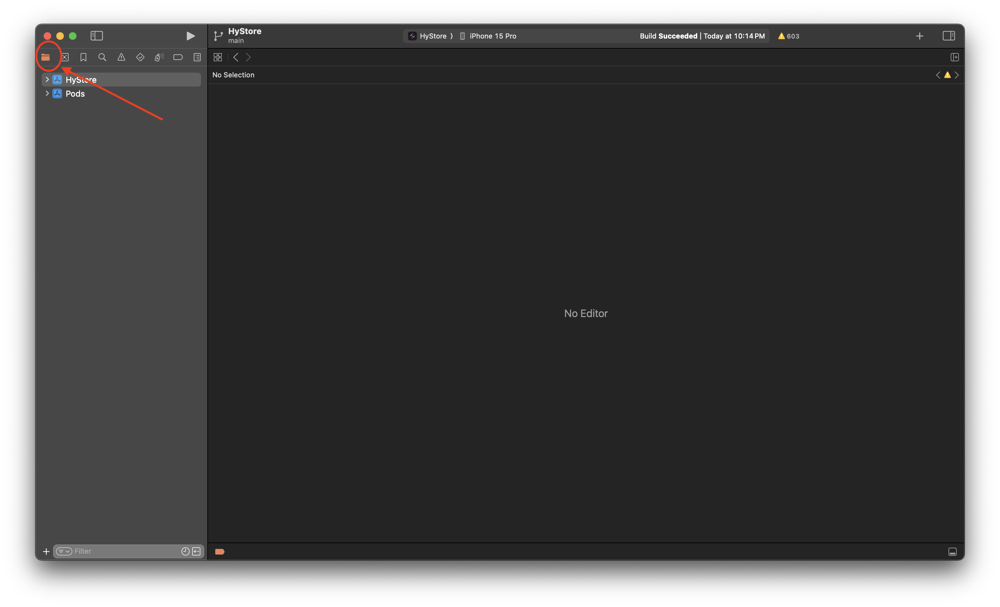

# <center></center> KittenStore

Welcome to **HyStore**!

HyStore is a clean and ad-free app for browsing altstore library's and installing apps from them.

## How to Build an .ipa

Every few weeks, I will build an ipa file so that you do not have to go through these steps but if you want the latest build you can follow these steps

<details>
<summary>Steps</summary>

Prerequisites:

- A mac that can run xcode or a VM that runs OS X
- Node.js 21

Steps:

1. run `npm i` in the project
2. run `npx expo prebuild --platform ios` to create an ios build
3. wait a little bit for it to finish

### If you have a Paid Apple Developer Account ($99/year)

> [!IMPORTANT]
> I have not tested this as I do not have a paid Apple Developer Account so you may need to edit some code.

1. just use Expo Application Services (EAS) to create up to 15 ios builds for free.

### If you Do not have an Apple Developer Account

> This does take a little longer and may run into more errors

<hr>

- Download Xcode from the App Store on your Mac.

> If you are on MacOS beta, then you need to download Xcode-beta from Apple's website

<hr>

- Open the Xcode Project by clicking `Open Existing Project`

<hr>



- if the file icon is not already selected, then do so

<hr>

- Select HyStore in the file tab

<hr>


- Choose Build Phases in the tabs

<hr>


- Click `+` on the panel and select `New Run Script Phase`

<hr>

- Go back to your terminal and run

```bash
sudo ln -s $(which node) /usr/local/bin/node
```

This creates a symlink to the default node location that xcode is looking for to your actual node location

<hr>

- Then in the script, paste the following:

```sh
# Load nvm if it's not loaded
export NVM_DIR="$HOME/.nvm"
if [ -s "$NVM_DIR/nvm.sh" ]; then
  source "$NVM_DIR/nvm.sh"
fi

# Ensure Node is available
export NODE_BINARY=/usr/local/bin/node
echo "Node found at: $NODE_BINARY"

"$NODE_BINARY" -v

# Run NativeWind/Tailwind CSS build command
"$NODE_BINARY" "$PROJECT_DIR/../node_modules/tailwindcss/lib/cli.js" -i "$PROJECT_DIR/../global.css" -o "$PROJECT_DIR/../node_modules/.cache/nativewind/global.css"

# Continue with the React Native build script
"$NODE_BINARY" --print "require('path').dirname(require.resolve('react-native/package.json')) + '/scripts/react-native-xcode.sh'"
```

<hr>

- Then At the top bar select product>archive and wait for the build to complete

<hr>

- then it should popup with a menu if the build is successful and right click the build and click show in finder

<hr>

- it should be a .xcarchive so right click and select show package contents and then select products>Applications

<hr>

- Then right click and select `New Folder` and type `Payload` (caps senstitive) and press enter

<hr>

- then drag HyStore into the Payload folder

<hr>

- then right click and select `Compress 'Payload'` and wait

<hr>

- then it should pop out a .zip. so please rename the package to a .ipa so it should be `Payload.ipa` from `Payload.zip`

<hr>

- Enjoy!

</details>

## Contribututing

idfk just trust

## License

I also dfk so just figure it out
